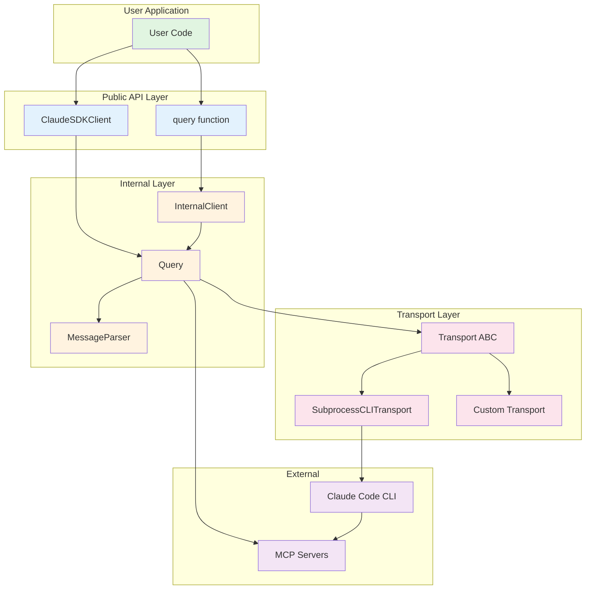
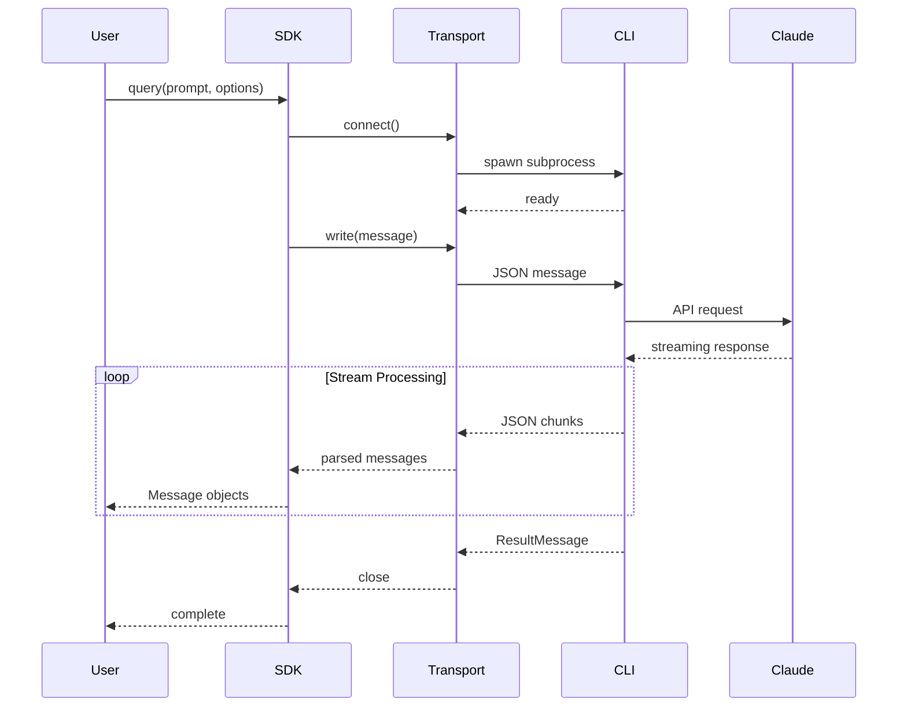
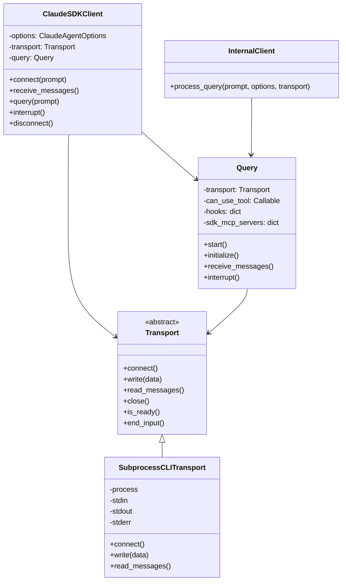
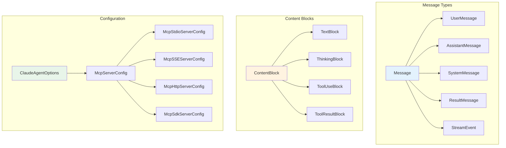
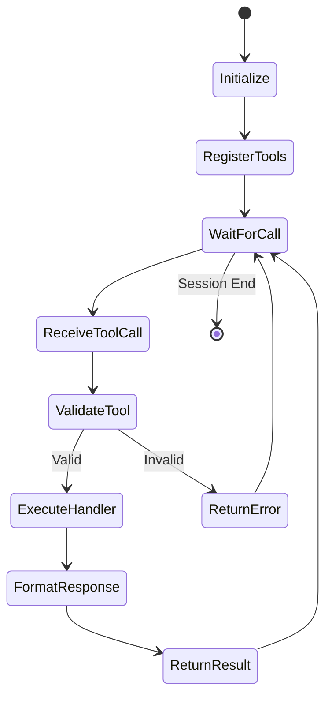

# Claude Agent SDK - Complete Architecture Documentation

## Table of Contents

1. [Executive Summary](#executive-summary)
2. [Quick Start Guide](#quick-start-guide)
3. [Architecture Overview](#architecture-overview)
4. [System Architecture Diagrams](#system-architecture-diagrams)
5. [Component Deep Dives](#component-deep-dives)
6. [Critical Code Paths](#critical-code-paths)
7. [Configuration & Deployment](#configuration--deployment)
8. [API/Interface Documentation](#apiinterface-documentation)
9. [Common Operations](#common-operations)
10. [Design Decisions & Technical Considerations](#design-decisions--technical-considerations)

---

## Executive Summary

The Claude Agent SDK is a Python library that provides programmatic access to Claude Code's capabilities through a structured API. It enables developers to build AI agents with comprehensive tool support including file operations, code execution, web search, and Model Context Protocol (MCP) extensibility. The SDK abstracts the complexity of communicating with the Claude Code CLI, handling message streaming, permission management, and session control through a clean async Python interface.

The architecture follows a layered design where high-level client abstractions (`query()` function and `ClaudeSDKClient` class) communicate with Claude Code through an internal transport layer that manages subprocess communication and message parsing. The system supports both one-shot queries and interactive bidirectional conversations with features like interrupts, permission mode changes, and dynamic model switching.

---

## Quick Start Guide

### Installation
```bash
pip install claude-agent-sdk
```

### Minimal Example
```python
import asyncio
from claude_agent_sdk import query, ClaudeAgentOptions

async def main():
    options = ClaudeAgentOptions(
        system_prompt="You are an expert Python developer",
        permission_mode='acceptEdits',
        cwd="/home/user/project"
    )

    async for message in query(
        prompt="Create a Python web server",
        options=options
    ):
        print(message)

asyncio.run(main())
```

### Interactive Session Example
```python
from claude_agent_sdk import ClaudeSDKClient

async def interactive_session():
    async with ClaudeSDKClient() as client:
        await client.query("Analyze this codebase")
        async for msg in client.receive_response():
            print(msg)

asyncio.run(interactive_session())
```

---

## Architecture Overview

The SDK architecture consists of four main layers:

1. **Public API Layer** - User-facing interfaces (`query()`, `ClaudeSDKClient`)
2. **Internal Control Layer** - Message routing and control protocol (`Query`, `InternalClient`)
3. **Transport Layer** - Process management and I/O (`Transport`, `SubprocessCLITransport`)
4. **Type System** - Comprehensive type definitions for all messages and configurations

### Core Design Patterns

- **Async-First**: All operations are async using Python's asyncio
- **Message Streaming**: Real-time message processing with AsyncIterators
- **Protocol Abstraction**: Clean separation between transport and protocol logic
- **Type Safety**: Extensive use of dataclasses and TypedDict for type safety
- **Extensibility**: Support for custom transports and MCP server integration

---

## System Architecture Diagrams

### High-Level Component Architecture



### Message Flow Architecture



### Class Hierarchy Diagram



### Data Type Hierarchy



### MCP Server Integration Flow



---

## Component Deep Dives

### 1. Public API Layer

#### `query()` Function
- **Purpose**: Simplified interface for one-shot queries
- **Location**: `/claude_agent_sdk/query.py`
- **Key Features**:
  - Stateless operation
  - Automatic connection management
  - Support for both string and AsyncIterable prompts
  - Custom transport injection

#### `ClaudeSDKClient` Class
- **Purpose**: Full-featured client for interactive conversations
- **Location**: `/claude_agent_sdk/client.py`
- **Key Features**:
  - Bidirectional communication
  - Session management
  - Runtime permission and model changes
  - Interrupt support
  - Context manager protocol

### 2. Internal Control Layer

#### `Query` Class
- **Purpose**: Implements SDK control protocol
- **Location**: `/_internal/query.py`
- **Responsibilities**:
  - Control message routing
  - Hook callback management
  - MCP server integration
  - Permission handling

#### `InternalClient` Class
- **Purpose**: Bridges public API to internal implementation
- **Location**: `/_internal/client.py`
- **Key Role**: Manages Query lifecycle for the simple query() function

### 3. Transport Layer

#### `Transport` Abstract Base Class
- **Purpose**: Defines transport interface
- **Location**: `/_internal/transport/__init__.py`
- **Methods**:
  - `connect()`: Establish connection
  - `write()`: Send data
  - `read_messages()`: Receive messages
  - `close()`: Cleanup

#### `SubprocessCLITransport`
- **Purpose**: Default transport using subprocess
- **Location**: `/_internal/transport/subprocess_cli.py`
- **Implementation Details**:
  - Spawns Claude Code CLI as subprocess
  - Manages stdin/stdout/stderr
  - JSON message serialization
  - Buffer management

### 4. Type System

#### Core Types
- **Messages**: `UserMessage`, `AssistantMessage`, `SystemMessage`, `ResultMessage`
- **Content**: `TextBlock`, `ThinkingBlock`, `ToolUseBlock`, `ToolResultBlock`
- **Configuration**: `ClaudeAgentOptions`, `McpServerConfig` variants
- **Permissions**: `PermissionMode`, `PermissionResult`, `PermissionUpdate`

---

## Critical Code Paths

### 1. Query Execution Flow

```python
# Entry point: query() function
async def query(prompt, options, transport):
    # 1. Set environment marker
    os.environ["CLAUDE_CODE_ENTRYPOINT"] = "sdk-py"

    # 2. Create internal client
    client = InternalClient()

    # 3. Process query through internal layer
    async for message in client.process_query(prompt, options, transport):
        # 4. Yield parsed messages to user
        yield message
```

### 2. Message Processing Pipeline

```python
# Transport reads raw data
async for line in self._read_stdout():
    # Parse JSON
    data = json.loads(line)

    # Route through Query for control messages
    if data.get("type") == "control_request":
        await self._handle_control_request(data)
    else:
        # Parse into typed Message objects
        message = parse_message(data)
        yield message
```

### 3. MCP Tool Execution

```python
# Tool registration
@tool("greet", "Greet a user", {"name": str})
async def greet(args):
    return {"content": [{"type": "text", "text": f"Hello, {args['name']}!"}]}

# Server creation
server = create_sdk_mcp_server("my_server", tools=[greet])

# Integration with Claude
options = ClaudeAgentOptions(
    mcp_servers={"server": server},
    allowed_tools=["greet"]
)
```

---

## Configuration & Deployment

### Environment Variables
- `CLAUDE_CODE_ENTRYPOINT`: Set automatically to identify SDK usage
- Standard Claude Code environment variables apply

### Key Configuration Options

```python
ClaudeAgentOptions(
    # Core settings
    system_prompt="Custom system prompt",
    permission_mode="acceptEdits",  # default, acceptEdits, plan, bypassPermissions
    model="claude-sonnet-4-5",

    # Environment
    cwd="/working/directory",
    env={"CUSTOM_VAR": "value"},

    # Tools
    allowed_tools=["Bash", "Read", "Write"],
    disallowed_tools=["dangerous_tool"],

    # MCP Servers
    mcp_servers={
        "custom": McpStdioServerConfig(
            command="mcp-server",
            args=["--option"]
        )
    },

    # Advanced
    can_use_tool=permission_callback,
    hooks={"PreToolUse": [hook_matcher]},
    max_buffer_size=1024*1024
)
```

### Deployment Considerations

1. **Process Management**: SDK spawns Claude Code CLI subprocess
2. **Resource Usage**: Each client maintains its own CLI process
3. **Error Handling**: Automatic retry and graceful degradation
4. **Scaling**: Use connection pooling for multiple concurrent sessions

---

## API/Interface Documentation

### Primary Functions

#### `query(prompt, options, transport) -> AsyncIterator[Message]`
One-shot query interface for simple interactions.

#### `ClaudeSDKClient(options, transport)`
Full client for interactive sessions.

### Message Types

All messages inherit from the `Message` base type:

- **UserMessage**: User input with content blocks
- **AssistantMessage**: Claude's responses with model info
- **SystemMessage**: System notifications and metadata
- **ResultMessage**: Session completion with cost/usage info
- **StreamEvent**: Partial message updates during streaming

### Permission System

```python
async def permission_callback(tool_name, input_data, context):
    if tool_name == "Write" and "/etc" in input_data.get("path", ""):
        return PermissionResultDeny(message="Cannot write to /etc")
    return PermissionResultAllow()
```

### Hook System

```python
async def pre_tool_hook(input_data, tool_use_id, context):
    # Log or modify tool usage
    return {"decision": "continue"}

hook_matcher = HookMatcher(
    matcher="Bash|Shell",
    hooks=[pre_tool_hook]
)
```

---

## Common Operations

### Basic Query
```python
async for msg in query(prompt="What is 2+2?"):
    if isinstance(msg, AssistantMessage):
        for block in msg.content:
            if isinstance(block, TextBlock):
                print(block.text)
```

### Interactive Conversation
```python
async with ClaudeSDKClient() as client:
    await client.query("Start analysis")
    async for msg in client.receive_response():
        # Process first response
        pass

    await client.query("Now explain in more detail")
    async for msg in client.receive_response():
        # Process follow-up
        pass
```

### Custom MCP Server
```python
@tool("database_query", "Query database", {"query": str})
async def db_query(args):
    # Execute query
    result = await execute_sql(args["query"])
    return {"content": [{"type": "text", "text": str(result)}]}

server = create_sdk_mcp_server("db_tools", tools=[db_query])
options = ClaudeAgentOptions(mcp_servers={"db": server})
```

### Stream Processing with Interrupts
```python
client = ClaudeSDKClient()
await client.connect()

# Start long-running task
await client.query("Analyze all files in directory")

# Monitor and potentially interrupt
async for msg in client.receive_messages():
    if should_interrupt(msg):
        await client.interrupt()
        break
```

---

## Design Decisions & Technical Considerations

### Architecture Decisions

1. **Subprocess over Direct API**: Uses Claude Code CLI for consistency with desktop experience
2. **Async-First Design**: All operations are async to handle I/O efficiently
3. **Message Streaming**: Real-time processing rather than batch responses
4. **Type Safety**: Extensive typing for better IDE support and runtime validation

### Performance Characteristics

- **Latency**: Subprocess spawn adds ~100-200ms overhead
- **Memory**: Each client maintains separate CLI process (~50-100MB)
- **Throughput**: Limited by CLI process I/O, typically 100-1000 msg/sec
- **Concurrency**: Each client is independent, scale horizontally

### Security Considerations

- **Permission Modes**: Default mode requires user approval for dangerous operations
- **Tool Restrictions**: Explicit allow/deny lists for tools
- **Subprocess Isolation**: Each session runs in isolated subprocess
- **Input Validation**: All inputs sanitized before passing to CLI

### Known Limitations

1. **Async Context Restriction**: Client must be used within same async context
2. **No Direct API Access**: All communication through CLI subprocess
3. **Platform Dependencies**: Requires Claude Code CLI to be installed
4. **Session State**: No built-in session persistence across process restarts

### Future Extensibility Points

- **Custom Transports**: Implement Transport ABC for remote Claude Code
- **MCP Servers**: Add custom tools through MCP protocol
- **Hook System**: Intercept and modify behavior at key points
- **Permission Callbacks**: Dynamic permission decisions

### Anti-Patterns to Avoid

1. **Blocking Operations**: Never use blocking I/O in callbacks
2. **Cross-Context Usage**: Don't share clients across async contexts
3. **Unbounded Buffers**: Always set max_buffer_size for long outputs
4. **Permission Bypass**: Avoid bypassPermissions in production

---

## Conclusion

The Claude Agent SDK provides a robust foundation for building AI agents with Claude Code's capabilities. Its layered architecture separates concerns effectively, while the comprehensive type system ensures safety and clarity. The transport abstraction enables future extensibility, and the MCP integration allows for custom tool development.

For production deployments, careful consideration of resource usage, permission models, and error handling patterns will ensure reliable operation. The SDK's design philosophy prioritizes developer experience through clean APIs while maintaining the flexibility needed for complex agent implementations.
